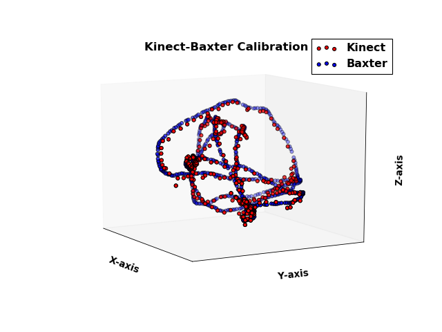
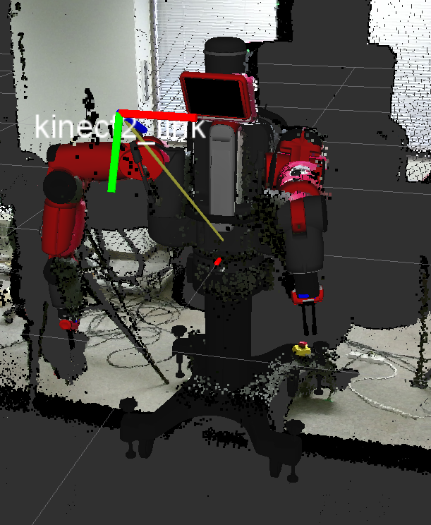

# kinect_baxter_calibration

ROS package to perform calibration between Kinect V2 depth sensor and Baxter research robot.

## Dependencies

### Hardware
* Workstation with Ubuntu 14.04 and ROS Indigo
* Baxter Research Robot
* Kinect V2 Sensor
* AR Marker

### Software
* Baxter SDK
* Kinect V2 ROS interface
* ar_track_alvar

### Installation

* Install ROS Indigo Desktop, Baxter SDK following instructions given [here](http://sdk.rethinkrobotics.com/wiki/Workstation_Setup).
* Install Kinect V2 driver and ros packages by following the instructions given [here](https://github.com/code-iai/iai_kinect2). Install packages in the same workspace as Baxter SDK packages.
* Install ar_track_alvar package:
```
$ sudo apt-get install ros-indigo-ar-track-alvar
```
* Clone package to workspace containing Baxter and Kinect packages. Build package using catkin_make
```
$ cd ros_ws/src/
$ git clone https://github.com/ShibataLabPrivate/kinect_baxter_calibration.git
$ cd .. && catkin_make
$ ./baxter.sh
```
* Installation instructions in Japanese are [here](docs/HowToInstall.md) and [here](docs/HowToInstallROS.md).

## Usage

The package has three different configurations for calibration between Baxter and Kinect. The last method provides the best results:

* **Screen Calibration**: Displays an AR marker on Baxter screen which is tracked by the Kinect. To run the calibration:
```
$ roslaunch kinect_baxter_calibration screen_calibration.launch
```
Press `Ctrl+C` to stop the nodes. To continue publishing the transformation matrix run the following:
```
$ roslaunch kinect_baxter_calibration publish_calibration.launch
```
To visualize the calibration results RViz can be used. Run RViz, add Tf, PointCloud2 and Robot Model for all the components. For further information, checkout `screen_calibration.launch`,`publish_calibration.launch`,`marker_calibration.py`,`publish_calibration.py` along with the files folder.

* **Gripper Calibration**: For this attach an AR marker to the electric gripper finger tips which is tracked by the Kinect. This assumes that the electric gripper along with standard narrow finger tips are installed on Baxter. To run the calibration:
```
$ roslaunch kinect_baxter_calibration gripper_calibration.launch
```
Press `Ctrl+C` to stop the nodes. To continue publishing the transformation matrix run the following:
```
$ roslaunch kinect_baxter_calibration publish_calibration.launch
```
To visualize the calibration results RViz can be used. Run RViz, add Tf, PointCloud2 and Robot Model for all the components. For further information, checkout `gripper_calibration.launch`,`publish_calibration.launch`,`marker_calibration.py`,`publish_calibration.py` along with the files folder.

* **Least Squares Calibration**: In this calibration, absolute orientation is used to compute the transformation matrix for simultaneous observation of an AR marker from the Kinect and Baxter frame of references.

  * Attach an AR marker to the electric gripper finger tips which is tracked by the Kinect. This assumes that the electric gripper along with standard narrow finger tips are installed on Baxter.
  * Move the arm such that the AR marker is visible to Kinect.
  * Collect dataset of observations by running:
  ```
  $ roslaunch kinect_baxter_calibration marker_track.launch
  ```
  * Press `Ctrl+C` to stop the launch file. To compute absolute orientation transformation matrix run the following:
  ```
  $ roslaunch kinect_baxter_calibration compute_calibration.launch
  ```
  * Press `Ctrl+C` to stop the launch file. To continue publishing the transformation matrix run the following:
  ```
  $ roslaunch kinect_baxter_calibration publish_calibration.launch
  ```
  * To visualize the calibration results RViz can be used. Run RViz, add Tf, PointCloud2 and Robot Model for all the components. For further information, checkout `marker_track.launch`,`publish_calibration.launch`,`compute_calibration.launch`,`marker_track.py`,`compute_calibration.py`,`publish_calibration.py` along with the files folder.

## Results

The screen calibration method is not so accurate as the marker can not be seen properly by the ar_track_alvar node. The gripper calibration has comparatively better accuracy. However, the least squares calibration method has the best performance as it is obtained from a dataset of observations. The results are shown below:





## Troubleshooting

* There seems to be a consistent bias during calibration and so to remove this bias, the calibration config files can be edited. The translation, theta parameters indicates the relative translation, relative rotation about z-axis between the AR marker and the nearest Tf frame in Baxter. By editing these parameters, sometimes the consistent bias can be removed. Please check `files/screen_calibration.yaml`,`files/gripper_calibration.yaml`.

* For the least squares calibration technique, we have recorded a hand trajectory such that the marker was easily visible for our setting. For a different setting, record a new trajectory using the example programs given in the Baxter SDK.

---
Like this repository if you found it useful. For any problems contact the contributors or create issues:
[Nishanth Koganti](https://github.com/buntyke), [Riku Nakata](https://github.com/Riku-Nakata), [Ravi Joshi](https://github.com/ravijo)
